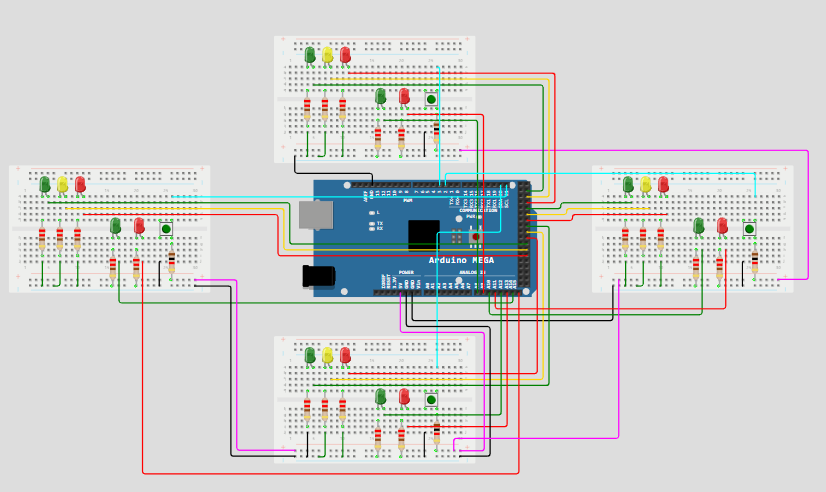

  

## 🖥️ Projeto
Esse é um projeto que controla os semáforos de 4 vias e 4 faixas de pedestres.

## 🚀 Tecnologias
Esse projeto foi desenvolvido durante o curso de Engenharia de Computação com as seguintes tecnologias:

- Arduino
- Github

## 🏷️ LAYOUT
Você pode visualizar o layout do projeto através 
[desse link](https://wokwi.com/projects/402327876478794753).
